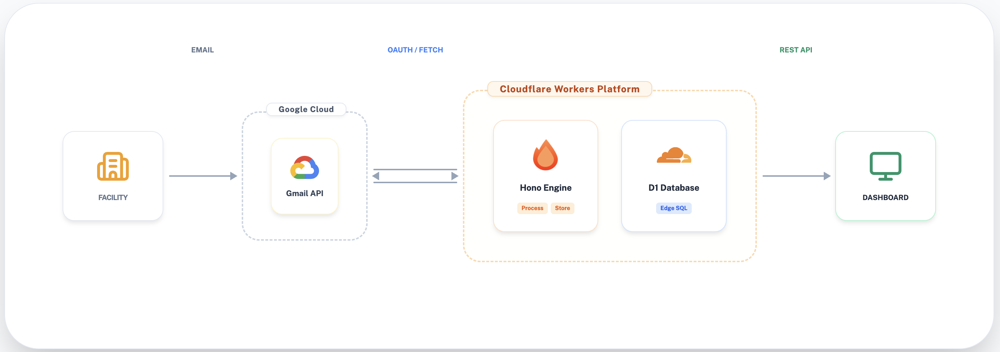

本システムのデータの流れをまとめた図です。



## 論理構成 (Detailed Architecture)

```mermaid
graph TD
    subgraph Client ["🌐 Client Layer"]
        U[User Browser / Swagger UI]
    end

    subgraph Cloudflare ["☁️ Cloudflare Workers Runtime"]
        subgraph HonoApp ["🚀 Hono Application"]
            H[Handlers / Routes]
            M[Middleware / Type Promotion]
            
            subgraph Services ["🛠️ Service Layer (Factory Functions)"]
                GS[GmailService]
                AS[AuthService]
                SO[SyncOrchestrator]
            end
            
            subgraph Data ["💾 Data Access"]
                R[Repositories (Factory Functions)]
                D[(Cloudflare D1)]
            end
        end
    end

    subgraph External ["🔌 External Integration"]
        G[Gmail API / OAuth2]
    end

    %% Interactions
    U <--> H
    H --> M
    M --> S
    H <--> Services
    Services <--> R
    R <--> D
    GS <--> G
```

## 3. 設計パターンと原則 (Architecture Evolution)

本プロジェクトでは、コードの品質と保守性を維持するために以下のパターンを採用しています。

### 3.1 Factory Function パターン
サービス層だけでなくリポジトリ層も Factory 関数化し、`this` の排除とカプセル化を徹底しています。
- 依存関係（Repositories, Env 等）をクロージャの引数として注入（DI）することで、モックを使用したユニットテストが容易になります。

### 3.2 Repository パターン & D1 Batching
データベースへの直接的なアクセス（SQLクエリ）を Repository レイヤーに集約しています。
- **Factory 関数化**: リポジトリも Factory 関数形式を採用し、アーキテクチャの一貫性を向上。
- **D1 Batch API**: `batchCreate` や `batchUpsert` を実装し、Cloudflare Workers と D1 間の通信回数を削減してパフォーマンスを最適化しています。

### 3.3 Type Promotion (Middleware)
Hono のミドルウェアを利用して、認証済みユーザー情報や初期化済みのサービスインスタンスを `Context` にセットし、ハンドラー側で「型が保証された状態」で利用できるようにしています。

---

## 4. 各コンポーネントの役割

- **Handlers**: HTTP リクエストを受け取り、適切なサービスに処理を委譲してレスポンスを返却。
- **Services**: ビジネスロジックの核。Gmail からのデータ取得やパース、同期のオーケストレーションを担う。
- **Repositories**: データの永続化。D1 への CRUD 操作を担当。
- **D1 Database**: Cloudflare の分散 SQLite データベース。
