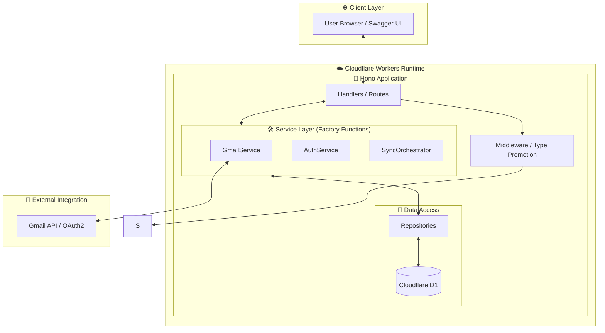

本システムのデータの流れをまとめた図です。

## 論理構成 (Detailed Architecture)

## 3. 設計パターンと原則 (Architecture Evolution)

本プロジェクトでは、コードの品質と保守性を維持するために以下のパターンを採用しています。

### 3.1 Factory Function パターン
各ドメインロジック（Gmail連携、認証、同期管理）は Factory 関数によって生成されます。
- `this` を使用しないため、`bind` 問題が発生せず、関数型プログラミングの恩恵を受けられます。
- 依存関係（Repositories, Env 等）をクロージャの引数として注入（DI）することで、モックを使用したユニットテストが容易になります。

### 3.2 Repository パターン
データベースへの直接的なアクセス（SQLクエリ）を Repository レイヤーに集約しています。
- ビジネスロジックが特定のデータベーススキーマや SQL 実装に依存しないようにします。

### 3.3 Type Promotion (Middleware)
Hono のミドルウェアを利用して、認証済みユーザー情報や初期化済みのサービスインスタンスを `Context` にセットし、ハンドラー側で「型が保証された状態」で利用できるようにしています。

---

## 4. 各コンポーネントの役割

- **Handlers**: HTTP リクエストを受け取り、適切なサービスに処理を委譲してレスポンスを返却。
- **Services**: ビジネスロジックの核。Gmail からのデータ取得やパース、同期のオーケストレーションを担う。
- **Repositories**: データの永続化。D1 への CRUD 操作を担当。
- **D1 Database**: Cloudflare の分散 SQLite データベース。
