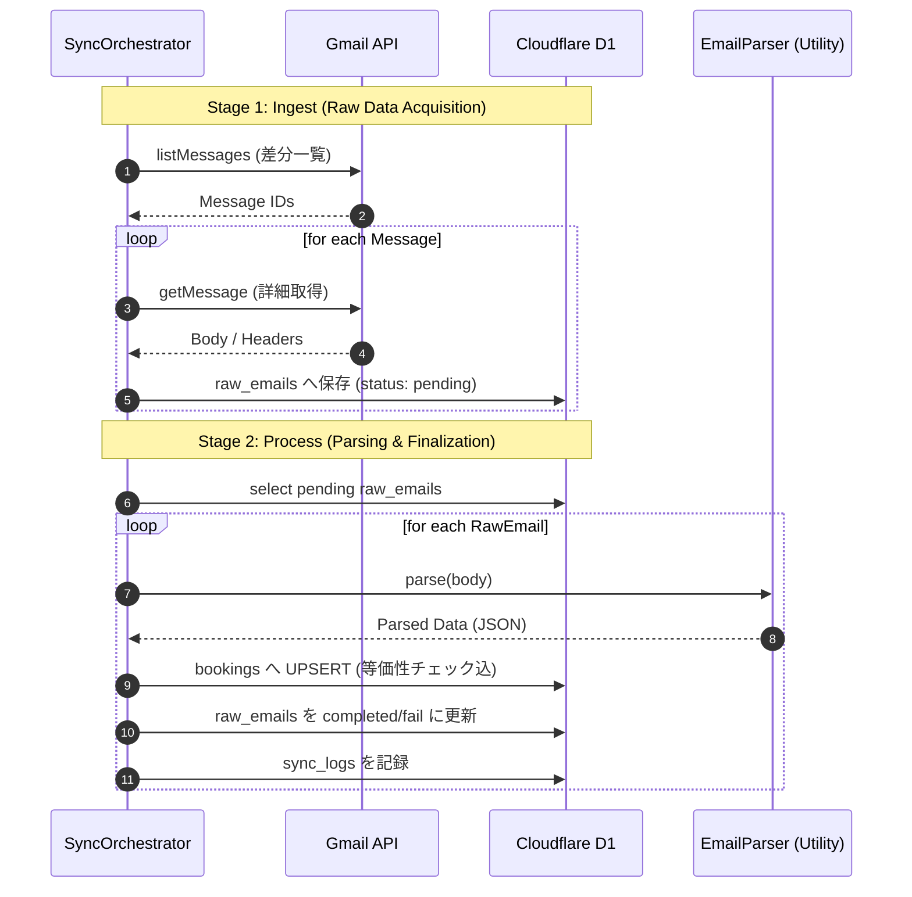

# ビジネスロジック設計書

本ドキュメントでは、Gym Booking Tracker におけるバックエンドの主要ロジック、特に定期的なメール収集とデータベースへの反映プロセスの詳細について定義する。

## 1. 同期ワークフロー (2-Stage Architecture)

同期処理は、外部 API との通信（フェッチ）と、アプリケーション内のデータ整合性（パース・保存）の責務を分離するため、以下の 2 段階のパイプラインで構成されています。

この分離により、Gmail API の制限（Rate Limit）やネットワークエラー、またはパース不具合が発生しても、生のメールデータを失うことなく再試行が可能になっています。

---

---

## 2. 詳細ロジック

### 2.1 差分同期（Delta Sync）と生データ保存 (Ingest)
- **フェッチ対象**: Gmail API の `list` リクエストで特定の条件に合致する最新メッセージを取得する。
- **重複排除と高速化**: 既にデータベースの `raw_emails` に存在するメッセージIDを検知した時点でAPIのページネーションフェッチを停止し、差分のみを高速に取り込む。取得したメールはステータス `pending` として保存する。

### 2.2 ステータス遷移ロジック (Parse)
未処理の `raw_emails` を時系列順（古い順）に取り出し、解析を行う。

- **受付番号によるマッチメイキング**: 
  - メールの `registration_number`（受付番号）や `facility_name` + `event_date` をキーにし、既存のレコードが存在する場合はステータスを更新する。
  - すでに「確定 (confirmed)」となっている予約データを「申込 (applied)」で上書きしないなど、ステータスの後退を防ぐガードロジックを適用する。

### 2.3 エラーハンドリングとスキップ判定
- **スキップ判定 (Skipped)**: 
  - 必須項目（日時や施設名）が見つからない、あるいは対象外の自動返信であるとパーサーが判断した場合、解析失敗 (`fail`) ではなく処理対象外 (`skipped`) として `raw_emails` を更新する。これにより運用上のノイズを低減する。
- **パース失敗 (Failed)**: 
  - 新しいメールフォーマット等で期待したデータが抽出できなかった場合は `sync_logs` にエラー詳細を記録し、今後のパーサー改善に活用する。

---

## 3. 実装のモジュール化 (Factory Function パターン)

コードの保守性とテスト容易性を最高レベルに保つため、以下の役割分担で **Factory Function** 形式の実装を行っています。各サービスはインターフェースをエクスポートし、生成関数を介してインスタンス（オブジェクト）を取得します。

1.  **Gmail Service (`createGmailService`)**: Gmail API との通信、トークンのリフレッシュ、メールデータの取得を担当。
2.  **Parser Service (`EmailParser`)**: 文字列からオブジェクトへの変換を担当（副作用のない純粋なロジック）。
3.  **Auth Service (`createAuthService`)**: ユーザーのログイン、プロファイル管理、JWTセッション発行を担当。
4.  **Google Auth Service (`createGoogleAuthService`)**: Google OAuth2 認可フロー（Code交換等）を担当。
5.  **Repository Layer (`createRepositories`)**: D1 への SQL 実行（INSERT/UPDATE）を抽象化して担当。
6.  **Sync Orchestrator (`createSyncOrchestrator`)**: 上記を組み合わせたメインの同期フロー（Ingest -> Parse）を担当。

---

## 4. セキュリティ
- **OAuth2 Token 管理**: `refresh_token` を安全に `wrangler secrets` で管理し、実行のたびに `access_token` を動的に生成する。
- **データベースアクセス**: 全てのクエリにプレースホルダを使用し、SQLインジェクションを防止する。
