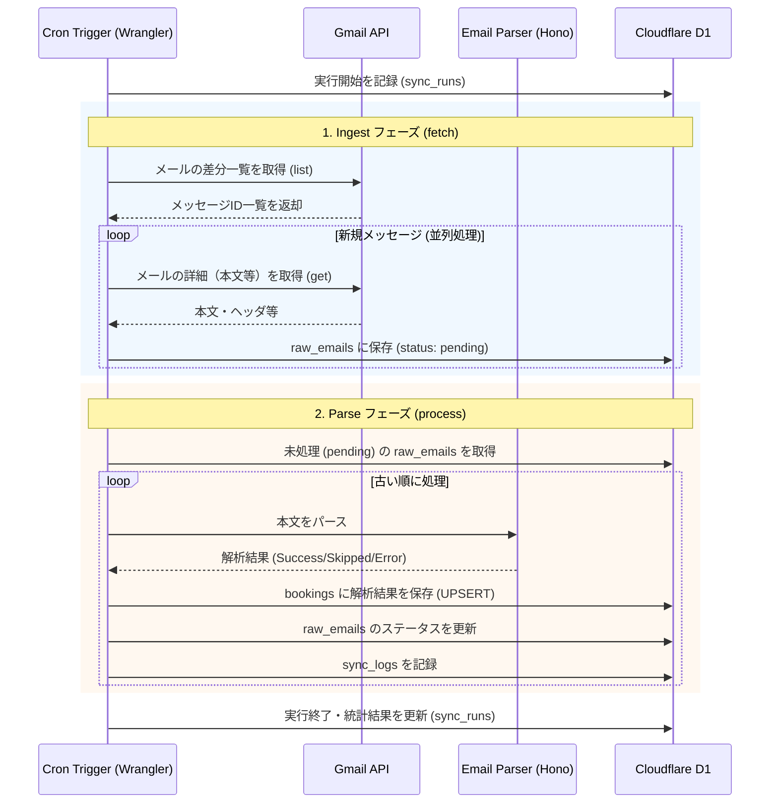

# ビジネスロジック設計書

本ドキュメントでは、Gym Booking Tracker におけるバックエンドの主要ロジック、特に定期的なメール収集とデータベースへの反映プロセスの詳細について定義する。

## 1. 全体ワークフロー (Cron / Scheduled Task)

システムは一定間隔（例: 1時間おき）で以下のフローを実行し、最新の予約状況を D1 に反映する。

---

## 2. 詳細ロジック

### 2.1 差分同期（Delta Sync）と生データ保存 (Ingest)
- **フェッチ対象**: Gmail API の `list` リクエストで特定の条件に合致する最新メッセージを取得する。
- **重複排除と高速化**: 既にデータベースの `raw_emails` に存在するメッセージIDを検知した時点でAPIのページネーションフェッチを停止し、差分のみを高速に取り込む。取得したメールはステータス `pending` として保存する。

### 2.2 ステータス遷移ロジック (Parse)
未処理の `raw_emails` を時系列順（古い順）に取り出し、解析を行う。

- **受付番号によるマッチメイキング**: 
  - メールの `registration_number`（受付番号）や `facility_name` + `event_date` をキーにし、既存のレコードが存在する場合はステータスを更新する。
  - すでに「確定 (confirmed)」となっている予約データを「申込 (applied)」で上書きしないなど、ステータスの後退を防ぐガードロジックを適用する。

### 2.3 エラーハンドリングとスキップ判定
- **スキップ判定 (Skipped)**: 
  - 必須項目（日時や施設名）が見つからない、あるいは対象外の自動返信であるとパーサーが判断した場合、解析失敗 (`fail`) ではなく処理対象外 (`skipped`) として `raw_emails` を更新する。これにより運用上のノイズを低減する。
- **パース失敗 (Failed)**: 
  - 新しいメールフォーマット等で期待したデータが抽出できなかった場合は `sync_logs` にエラー詳細を記録し、今後のパーサー改善に活用する。

---

## 3. 実装のモジュール化

コードの保守性を高めるため、以下の役割分担で実装を行う。

1.  **Collector Service**: Gmail API との通信を担当。
2.  **Parser Service**: 文字列からオブジェクトへの変換を担当（純粋関数）。
3.  **Repository Layer**: D1 への SQL 実行（INSERT/UPDATE）を担当。
4.  **Sync Orchestrator**: 上記を組み合わせたメインの同期フローを担当（Cronから呼ばれる）。

---

## 4. セキュリティ
- **OAuth2 Token 管理**: `refresh_token` を安全に `wrangler secrets` で管理し、実行のたびに `access_token` を動的に生成する。
- **データベースアクセス**: 全てのクエリにプレースホルダを使用し、SQLインジェクションを防止する。
