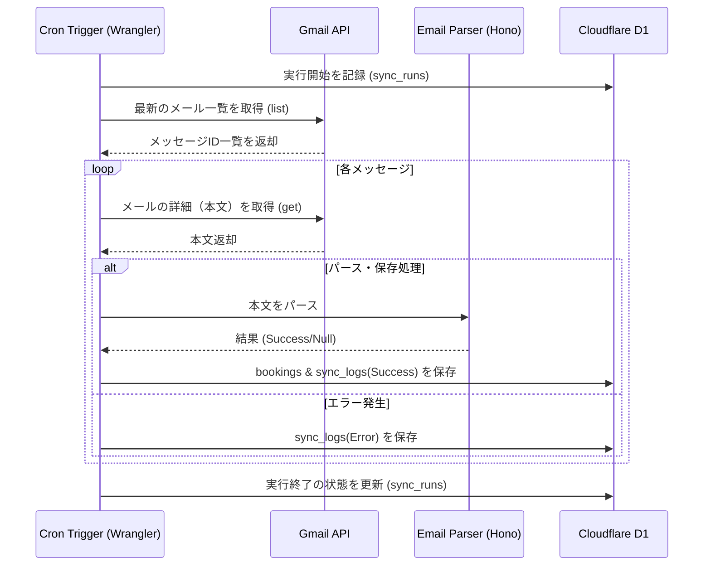

# ビジネスロジック設計書

本ドキュメントでは、Gym Booking Tracker におけるバックエンドの主要ロジック、特に定期的なメール収集とデータベースへの反映プロセスの詳細について定義する。

## 1. 全体ワークフロー (Cron / Scheduled Task)

システムは一定間隔（例: 1時間おき）で以下のフローを実行し、最新の予約状況を D1 に反映する。

---

## 2. 詳細ロジック

### 2.1 メールの選別と重複排除
- **フェッチ対象**: Gmail API の `list` リクエストで、特定のラベル（例：`gym-booking`）や、送信元/件名でフィルタリングされた最新メッセージを取得する。
- **重複排除**: D1 の `bookings.raw_mail_id` に対する UNIQUE 制約によりデータベース層でも担保するが、APIリクエストを減らすため `EXISTS` クエリ等で事前チェックを行う。

### 2.2 ステータス遷移ロジック
同一の `raw_mail_id` に対して複数のメールが届くことはないが、同じ「予約（受付番号）」に対して異なるステータスのメール（申込 -> 当選 -> キャンセル）が届く場合がある。

- **受付番号によるマッチメイキング**: 
  - メールの `registration_number`（受付番号）をキーにし、既存のレコードがある場合はステータスを更新する。
  - 受付番号がない古い形式や施設の場合は、`facility_name` + `event_date` の組み合わせで既存レコードを特定する。

### 2.3 エラーハンドリングとリトライ
- **パース失敗**: 
  - 新しいメールフォーマットが登場した場合など、パーサーが `null` を返したときは、`sync_logs` に `status: error` とエラー詳細を記録し、管理者へ通知（将来的な拡張）を行う。
- **APIレート制限**: 
  - Google API のレート制限に達した場合は、指数バックオフでリトライするか、次回の Cron 実行まで処理を延期する。

---

## 3. 実装のモジュール化

コードの保守性を高めるため、以下の役割分担で実装を行う。

1.  **Collector Service**: Gmail API との通信を担当。
2.  **Parser Service**: 文字列からオブジェクトへの変換を担当（純粋関数）。
3.  **Repository Layer**: D1 への SQL 実行（INSERT/UPDATE）を担当。
4.  **Sync Orchestrator**: 上記を組み合わせたメインの同期フローを担当（Cronから呼ばれる）。

---

## 4. セキュリティ
- **OAuth2 Token 管理**: `refresh_token` を安全に `wrangler secrets` で管理し、実行のたびに `access_token` を動的に生成する。
- **データベースアクセス**: 全てのクエリにプレースホルダを使用し、SQLインジェクションを防止する。
