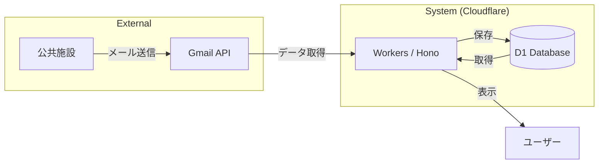

# システム構成図 (Architecture Diagram)

本システムのデータの流れをシンプルにまとめた図です。

## 各コンポーネントの役割

- **公共施設**: 予約の抽選結果や確定通知をメールで送信。
- **Google Cloud (Gmail API)**: メールのホスティングおよび API 経由でのデータ提供。
- **Cloudflare Workers (Hono)**: システムの核となるバックエンド。メールの取得、パース、データ管理、API提供を担う。
- **Cloudflare D1**: 抽出された予約情報を保持するリレーショナルデータベース。
- **User Dashboard**: ユーザーが一元化された情報を確認するためのインターフェース。
